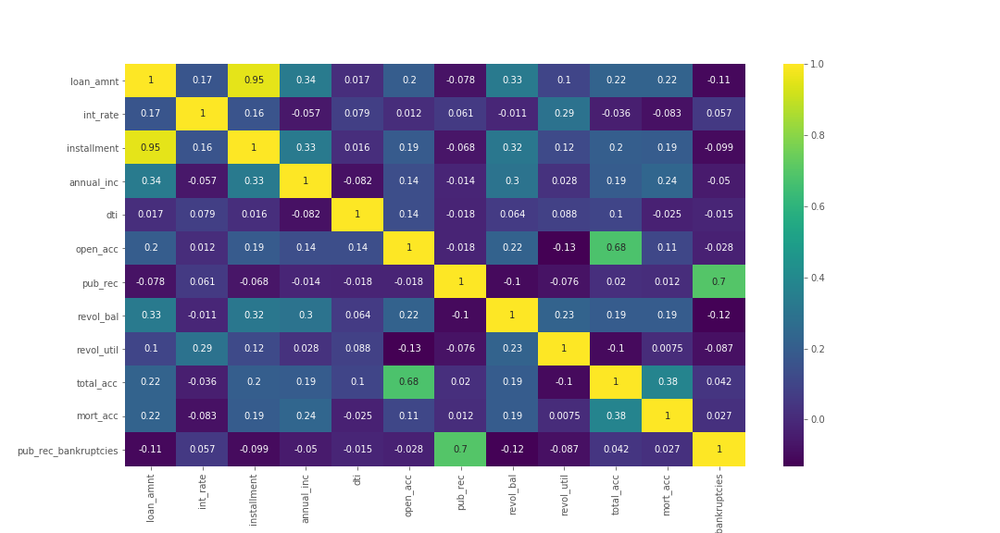
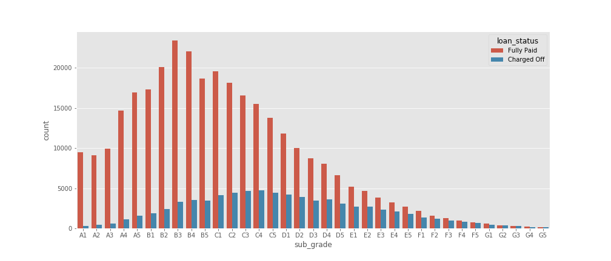
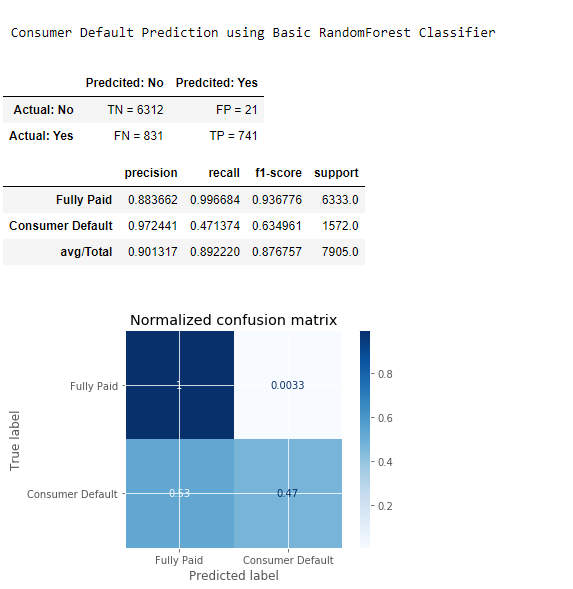
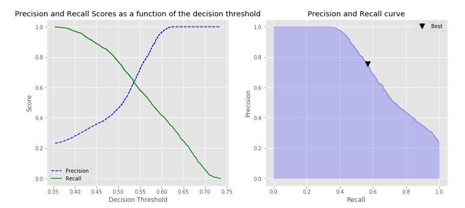
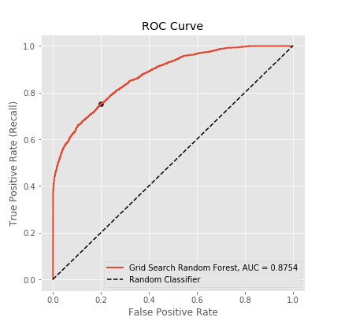
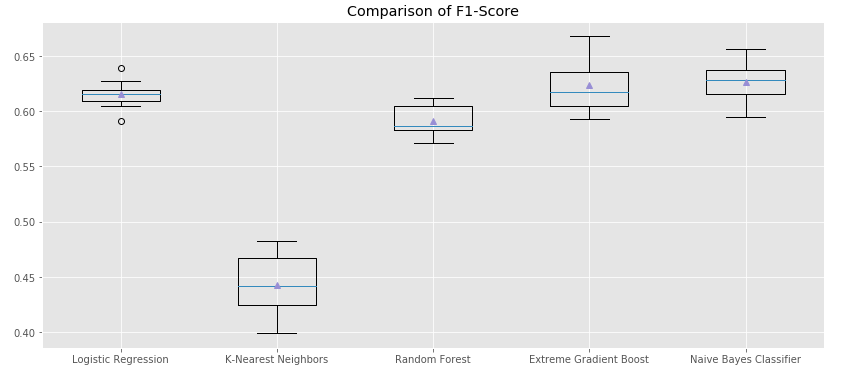
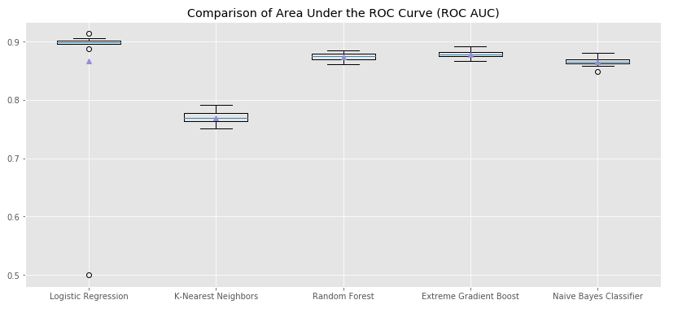

# Comprehensive Evaluation of Machine Learning Techniques to Predict Customer Default
Here historical loan application data from Lending Club Loans are used to predict whether or not an applicant will be able to repay a loan. This is a supervised classification task in which, The labels are included in the training data and the model will be trained to predict the labels from the features. Performances of several machine learning classifiers are compared with respect to multiple accuracy metrics including precision, recall and ROC curves.

Following Machine Learning classifiers are investigated here:

- Random Forest (Ensemble of Decision Trees) 
- Logistic Regression
- K-Nearest Neighbors
- Extreme Gradient Boost Model
- Naive Bayes Classifier

## Project background and objectives
Exploratory data analysis was conducted to understand relationship between features, view summary statistics, and visualize the data. Following is a heatmap from the project to visualize correlation between feature variables. 

The total number of loans was plotted against different feature variables exploring if the loans are ""Fully Paid" or "Charged Off":

Missing data was carefully examined and the most correlated features were used to estimate the missing values. String values and categorical features were handled in the next step. The train/test split of data followed by normalization (MinMaxScaler) fit to only X_train and applied to X_test. Five different Machine Learning classifiers were trained in this project and their accuracy metrics were examined as follows:

GridSearchCV was utilized to search for the best hyperparameters and tune the model to achive the highest recall score. The combinations of parameters resulted in top 5 scored model then printed in a table format. 

Obviously, there will be some error associated with every model results in False Positives and False Negatives due to the model classifying things incorrectly as compared to the actual class. There might be the cases where we might want to minimize either False Positives or False negatives depends on the business needs and the context of the problem. Modifying the decision threshold of the model is basically tradeoff between sensitivity and specificity. Functions were developed to find the optimized threshold according to precision_recall_curve and roc_curve and visualized accordingly.

Following plot identifies the optimal threshold based on precision-recall curve:

and identifying the optimal threshold based on ROC curve:

Finally, performance of investigated classifiers are compared in terms of F1-score and roc_auc and presented in a box plot format.

## Project Structure and Sections

This project is an implementation of five Machine Learning classifiers and comparison of their performance after fine tuning of parameters and optimizing of the classification threshold. Following is the project structure and list of sections:

* Section 1: Exploratory Data Analysis
* Section 2: Handling Missing Data and Categorical Variables
* Section 3: Train Test Split and Normalizing Data
* Section 4: A Review of Accuracy Metrics
* Section 5: Random Forest - Ensemble of Decision Trees
* Section 6: Logistic Regression
* Section 7: KNeighborsClassifier
* Section 8: Extreme Gradient Boost Model
* Section 9: Naive Bayes Classifier
* Section 10: Comparison of the Investigated Classifier

# Quick start
**unzip the "lending_club_loan_two.zip" file located in folder "dataset". Make sure the file "lending_club_loan_two.csv" is accessible by Jupiter notebook as "dataset\lending_club_loan_two.csv"**

## Dependencies
* Pandas
* Numpy

How to use?
===========
The project is developed in Jupyter Notebooks which is automatically rendered by GitHub. The developed codes and functions for each step are explained in the notebook.

